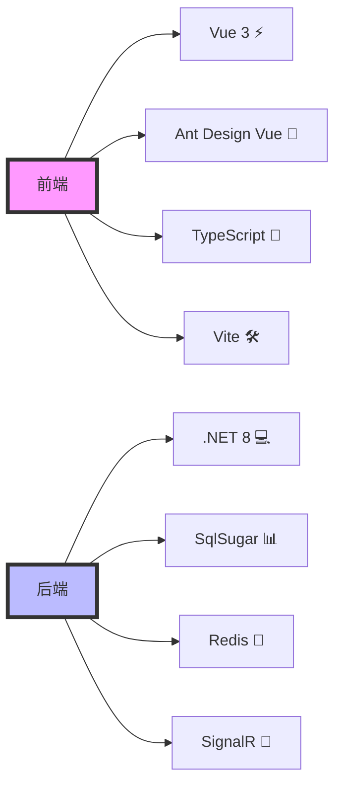
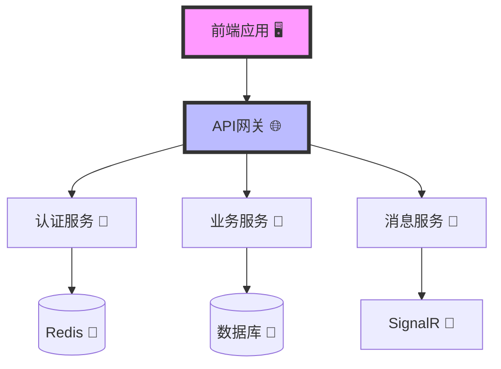
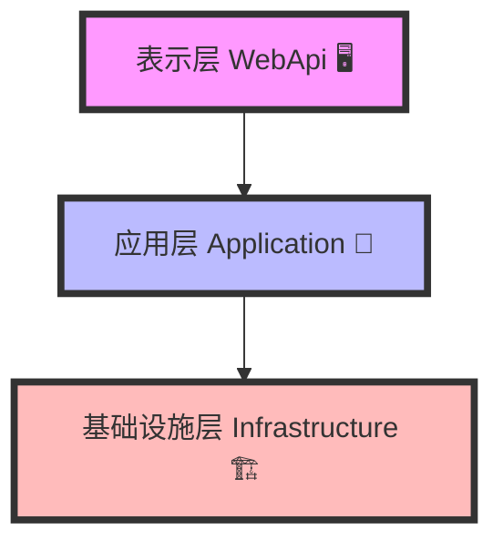
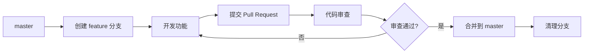

# 🎯 极限节拍平台 (Takt.Xp)

## 📚 目录

- [🎯 极限节拍平台 (Takt.Xp)](#-极限节拍平台-taktxp)
  - [📚 目录](#-目录)
  - [💫 项目简介](#-项目简介)
    - [🚀 技术栈](#-技术栈)
      - [🔧 后端技术](#-后端技术)
      - [🎨 前端技术](#-前端技术)
  - [🏗️ 系统架构](#️-系统架构)
    - [📐 整体架构](#-整体架构)
    - [🔄 分层架构](#-分层架构)
  - [📂 项目结构](#-项目结构)
  - [💎 核心功能模块](#-核心功能模块)
    - [🔐 权限管理模块](#-权限管理模块)
      - [1. 用户认证](#1-用户认证)
      - [2. 权限控制](#2-权限控制)
      - [3. 组织架构](#3-组织架构)
      - [4. 安全特性](#4-安全特性)
    - [⚙️ 代码生成器模块](#️-代码生成器模块)
      - [1. 模板引擎](#1-模板引擎)
      - [2. 数据源管理](#2-数据源管理)
      - [3. 代码生成](#3-代码生成)
      - [4. 生成策略](#4-生成策略)
    - [🔄 工作流引擎模块](#-工作流引擎模块)
      - [1. 流程设计](#1-流程设计)
      - [2. 流程管理](#2-流程管理)
      - [3. 任务处理](#3-任务处理)
      - [4. 高级特性](#4-高级特性)
    - [📡 实时通信模块](#-实时通信模块)
      - [1. SignalR集成](#1-signalr集成)
      - [2. 消息管理](#2-消息管理)
    - [🎨 前端功能](#-前端功能)
      - [1. 主题定制](#1-主题定制)
      - [2. 组件封装](#2-组件封装)
      - [3. 状态管理](#3-状态管理)
    - [🌐 多语言支持](#-多语言支持)
      - [前端多语言](#前端多语言)
      - [后端多语言](#后端多语言)
  - [💻 开发环境](#-开发环境)
    - [🛠️ 必需工具](#️-必需工具)
    - [🔧 推荐工具](#-推荐工具)
    - [⚙️ IDE 配置](#️-ide-配置)
  - [🚀 快速开始](#-快速开始)
    - [📋 环境准备](#-环境准备)
    - [📥 安装步骤](#-安装步骤)
      - [1️⃣ 克隆项目](#1️⃣-克隆项目)
      - [2️⃣ 安装后端依赖](#2️⃣-安装后端依赖)
      - [3️⃣ 安装前端依赖](#3️⃣-安装前端依赖)
    - [⚙️ 基础配置](#️-基础配置)
    - [🎮 运行命令](#-运行命令)
      - [启动后端服务](#启动后端服务)
      - [启动前端开发服务器](#启动前端开发服务器)
  - [💾 数据库设计](#-数据库设计)
    - [📊 核心表结构](#-核心表结构)
    - [📜 初始化脚本](#-初始化脚本)
  - [📚 API文档](#-api文档)
    - [📋 接口规范](#-接口规范)
    - [🔐 认证授权](#-认证授权)
  - [🔒 代码审查和分支保护规则](#-代码审查和分支保护规则)
    - [📋 强制审查范围](#-强制审查范围)
      - [1️⃣ 字段命名变更](#1️⃣-字段命名变更)
      - [2️⃣ CRUD 操作变更](#2️⃣-crud-操作变更)
      - [3️⃣ 导入导出功能变更](#3️⃣-导入导出功能变更)
    - [🎯 审查重点](#-审查重点)
      - [✅ 命名规范](#-命名规范)
      - [✅ 代码一致性](#-代码一致性)
      - [✅ 性能考虑](#-性能考虑)
    - [🌿 分支管理](#-分支管理)
      - [保护分支规则](#保护分支规则)
      - [开发流程](#开发流程)
    - [🤖 自动化检查](#-自动化检查)
    - [📚 文档要求](#-文档要求)
  - [🤝 贡献指南](#-贡献指南)
    - [贡献流程](#贡献流程)
    - [贡献规范](#贡献规范)
  - [📄 许可证](#-许可证)
    - [📋 MIT License 说明](#-mit-license-说明)
      - [✅ 允许的行为](#-允许的行为)
      - [⚠️ 唯一要求](#️-唯一要求)
      - [🔒 免责声明](#-免责声明)
  - [⚠️ 二次开发声明](#️-二次开发声明)
    - [📦 公共包引用](#-公共包引用)
      - [基础组件](#基础组件)
      - [缓存组件](#缓存组件)
      - [认证授权](#认证授权)
      - [通信组件](#通信组件)
      - [工具组件](#工具组件)
  - [📐 全局规范](#-全局规范)
    - [1. 序列化规范](#1-序列化规范)
      - [配置示例](#配置示例)
      - [规范要求](#规范要求)
  - [📚 开发规范文档](#-开发规范文档)
    - [前端规范](#前端规范)
  - [后端开发规范](#后端开发规范)

## 💫 项目简介

**Takt.Xp（极限节拍）** 是一个基于 **.NET 8** 的现代化企业级开发平台，采用 **DDD（领域驱动设计）** 分层架构，集成了权限管理、代码生成、工作流引擎、实时通信等核心功能模块。

> 💡 **核心特性**
> - 🏗️ **DDD 分层架构**：清晰的领域边界和职责划分
> - 🔐 **完善的权限体系**：RBAC 权限模型，支持多租户
> - ⚙️ **强大的代码生成器**：一键生成前后端代码
> - 🔄 **灵活的工作流引擎**：支持多种流程设计器
> - 📡 **实时通信**：基于 SignalR 的实时消息推送
> - 🌐 **多语言支持**：前后端完整的多语言方案

### 🚀 技术栈



#### 🔧 后端技术

| 技术 | 说明 | 版本 |
|------|------|------|
| 🎯 .NET | 核心框架 | 8.0+ |
| 📊 SqlSugar | ORM 框架 | 5.1.4+ |
| ⚡ Redis | 缓存服务 | 6.0+ |
| 📡 SignalR | 实时通信 | 8.0+ |
| 🔐 JWT | 身份认证 | 8.0+ |
| 📚 Swagger | API 文档 | 8.1.4+ |

#### 🎨 前端技术

| 技术 | 说明 | 版本 |
|------|------|------|
| ⚡ Vue 3 | 前端框架（Composition API） | 3.4+ |
| 🎨 Ant Design Vue | UI 组件库 | 4.2+ |
| 🛠️ Vite | 构建工具 | 5.0+ |
| 📝 TypeScript | 开发语言 | 5.0+ |
| 📦 Pinia | 状态管理 | 2.1+ |
| 🌐 Axios | HTTP 客户端 | 1.11+ |

**工作流设计器支持：**
- 📊 **TaktFlow**: 基于 `@antv/x6` 的工作流设计器
- 🔗 **TaktJsplumbFlow**: 基于 `jsPlumb` 的工作流设计器  
- 🎯 **TaktLogicFlow**: 基于 `@logicflow/core` 的工作流设计器

**其他核心依赖：**
- 📡 `@microsoft/signalr` - 实时通信
- 📝 `@wangeditor/editor` - 富文本编辑器
- 🎨 `@form-create/ant-design-vue` - 表单设计器

## 🏗️ 系统架构

### 📐 整体架构



### 🔄 分层架构



## 📂 项目结构

```
Takt.Xp/
├── backend/                  # 💻 后端项目
│   ├── src/                 # 📦 源代码
│   │   ├── Takt.Application/    # 📱 应用层
│   │   │   ├── Services/       # 🔧 应用服务
│   │   │   │   ├── Accounting/     # 💰 财务服务
│   │   │   │   ├── Generator/      # ⚙️ 代码生成服务
│   │   │   │   ├── Identity/       # 🔐 身份认证服务
│   │   │   │   ├── Logging/        # 📝 日志服务
│   │   │   │   ├── Logistics/      # 📦 物流服务
│   │   │   │   ├── Routine/        # 📋 常规服务
│   │   │   │   └── Workflow/       # 🔄 工作流服务
│   │   │   └── DTOs/          # 📄 数据传输对象
│   │   ├── Takt.Shared/         # 🔧 公共层
│   │   │   ├── Constants/      # 📋 常量定义
│   │   │   ├── Enums/          # 🔢 枚举类型
│   │   │   ├── Extensions/     # 🔌 扩展方法
│   │   │   ├── Helpers/        # 🛠️ 辅助工具
│   │   │   ├── Models/         # 📊 基础模型
│   │   │   ├── Options/        # ⚙️ 配置选项
│   │   │   └── Utils/          # 🧰 工具类
│   │   ├── Takt.Domain/         # 🏛️ 领域层
│   │   │   ├── Entities/       # 🏗️ 实体类
│   │   │   │   ├── Accounting/     # 💰 财务实体
│   │   │   │   ├── Generator/      # ⚙️ 代码生成实体
│   │   │   │   ├── HumanResource/  # 👥 人力资源实体
│   │   │   │   ├── Identity/       # 🔐 身份实体
│   │   │   │   ├── Logistics/      # 📦 物流实体
│   │   │   │   ├── Routine/        # 📋 常规实体
│   │   │   │   └── Workflow/       # 🔄 工作流实体
│   │   │   ├── Interfaces/     # 🔌 接口定义
│   │   │   ├── IServices/      # 🔧 服务接口
│   │   │   ├── Repositories/   # 📚 仓储接口
│   │   │   ├── Models/         # 📊 领域模型
│   │   │   └── Caching/        # 🚀 缓存接口
│   │   ├── Takt.Infrastructure/ # 🏗️ 基础层
│   │   │   ├── Authentication/ # 🔐 身份认证
│   │   │   ├── Caching/        # 🚀 缓存实现
│   │   │   ├── Data/           # 💾 数据访问
│   │   │   │   ├── Contexts/       # 📊 数据库上下文
│   │   │   │   └── Seeds/          # 🌱 种子数据
│   │   │   ├── Repositories/   # 📚 仓储实现
│   │   │   ├── Services/       # 🔧 服务实现
│   │   │   ├── Security/       # 🛡️ 安全组件
│   │   │   ├── SignalR/        # 📡 实时通信
│   │   │   ├── Swagger/        # 📚 API文档
│   │   │   ├── Middleware/     # 🔗 中间件
│   │   │   └── Jobs/           # ⏰ 定时任务
│   │   └── Takt.WebApi/         # 🌐 接口层
│   │       ├── Controllers/    # 🎮 控制器
│   │       ├── Middlewares/    # 🔗 中间件
│   │       ├── Resources/      # 📁 资源文件
│   │       └── wwwroot/        # 🌐 静态资源
│   │           ├── Generator/      # ⚙️ 代码生成模板
│   │           └── uploads/       # 📤 上传文件
│   └── Takt.Xp.sln            # 🔧 解决方案文件
│
├── frontend/               # 🎨 前端项目
│   └── Takt.Antd/         # 🎨 Ant Design Vue 前端
│       ├── src/           # 📦 源代码
│       │   ├── api/      # 🌐 API接口
│       │   │   ├── accounting/   # 💰 财务接口
│       │   │   ├── generator/   # ⚙️ 代码生成接口
│       │   │   ├── identity/     # 🔐 身份接口
│       │   │   ├── logging/     # 📝 日志接口
│       │   │   ├── logistics/   # 📦 物流接口
│       │   │   ├── routine/     # 📋 常规接口
│       │   │   ├── security/     # 🛡️ 安全接口
│       │   │   └── workflow/    # 🔄 工作流接口
│       │   ├── assets/   # 🖼️ 静态资源
│       │   ├── components/   # 🧩 公共组件
│       │   │   ├── Business/    # 💼 业务组件
│       │   │   │   ├── TaktFlow/        # 🔄 工作流设计器(X6)
│       │   │   │   ├── TaktJsplumbFlow/ # 🔄 工作流设计器(jsPlumb)
│       │   │   │   └── TaktLogicFlow/  # 🔄 工作流设计器(LogicFlow)
│       │   │   ├── common/      # 🔧 通用组件
│       │   │   ├── Navigation/  # 🧭 导航组件
│       │   │   └── SignalR/    # 📡 实时通信组件
│       │   ├── layouts/     # 📐 布局组件
│       │   ├── locales/     # 🌐 多语言文件
│       │   ├── router/      # 🗺️ 路由配置
│       │   ├── stores/      # 📦 状态管理(Pinia)
│       │   ├── types/       # 📝 类型定义
│       │   ├── utils/       # 🛠️ 工具函数
│       │   └── views/       # 📄 页面组件
│       │       ├── identity/    # 🔐 身份管理
│       │       ├── generator/   # ⚙️ 代码生成
│       │       ├── workflow/   # 🔄 工作流
│       │       ├── logging/    # 📝 日志管理
│       │       └── routine/    # 📋 常规功能
│       └── public/          # 📁 公共资源
│
├── docs/                   # 📚 文档目录
│   ├── standards/          # 📋 开发规范
│   └── configuration/      # ⚙️ 配置文档
│
├── scripts/                # 📜 部署脚本
├── .editorconfig          # ⚙️ 编辑器配置
├── .gitignore            # 🚫 Git忽略文件
└── README.md             # 📖 项目说明
```

## 💎 核心功能模块

### 🔐 权限管理模块

#### 1. 用户认证
- 🔑 JWT Token认证
- 🔄 OAuth2.0/OpenID Connect集成
- 👤 统一身份认证中心(Identity Server 4)
- 🔒 单点登录(SSO)支持

#### 2. 权限控制
- 👥 RBAC角色权限模型
- 🏢 多租户支持
- 🔍 数据权限控制
- 🚦 API访问控制
- 🎯 按钮级权限控制

#### 3. 组织架构
- 📊 多级组织结构
- 👥 用户组管理
- 📋 岗位管理
- 🔄 组织关系维护

#### 4. 安全特性
- 🔒 密码策略管理
- 🚫 登录限制策略
- 📝 操作日志审计
- ⚡ 实时会话管理

### ⚙️ 代码生成器模块

#### 1. 模板引擎
- 📋 Scriban模板引擎
- 🎨 自定义模板支持
- 🔄 模板版本管理
- 📝 在线模板编辑

#### 2. 数据源管理
- 💾 多数据库支持
- 📊 表结构解析
- 🔗 关联关系分析
- 📋 字段映射配置

#### 3. 代码生成
- 💻 实体模型生成
  - 引用实体基类
- 📝 数据传输对象生成
  - CRUD对象
  - 导入导出DTO对象
  - 特定DTO对象
- 🔧 仓储层代码生成
  - 仓储接口
  - 仓储实现
- 🔨 服务层代码生成
  - 服务接口
  - 服务实现
- 🎮 控制器代码生成
- 🎨 前端代码生成
  - API接口文件
  - 多语言翻译文件
  - 列表页面(基于Ant Design Vue)
    - 查询表单
    - 数据表格
    - 新增/编辑表单
    - 详情页面
  - 导入/导出功能

#### 4. 生成策略
- ⚙️ 命名规则配置
- 🎯 字段类型映射
- 🔄 覆盖策略设置
- 📋 代码注释生成

### 🔄 工作流引擎模块

#### 1. 流程设计

**三种工作流设计器实现，满足不同场景需求：**

| 设计器 | 技术栈 | 适用场景 | 特点 |
|--------|--------|----------|------|
| **TaktFlow** | @antv/x6 | 复杂流程、高性能需求 | 功能强大，性能优异 |
| **TaktJsplumbFlow** | jsPlumb | 传统流程、兼容性好 | 稳定可靠，易于定制 |
| **TaktLogicFlow** | LogicFlow 2.x | 现代化流程、插件丰富 | 原生插件支持，扩展性强 |

**核心功能：**
- 📋 流程模板管理
- 🎯 节点类型配置（开始、结束、任务、网关、会签等）
- 🔗 流程连线规则
- 🎨 可视化拖拽设计

#### 2. 流程管理
- 📝 流程定义管理
- 🚀 流程实例管理
- 📊 流程监控统计
- 🔍 流程历史查询

#### 3. 任务处理
- 📋 待办任务管理
- 📝 任务处理接口
- 🔄 任务转交/委托
- 📊 任务统计分析

#### 4. 高级特性
- 🔄 并行处理支持
- 🎯 条件分支控制
- ⏱️ 定时任务集成
- 📊 业务数据关联

### 📡 实时通信模块

#### 1. SignalR集成
- 🔌 实时消息推送
- 👥 在线用户管理
- 🔄 自动重连机制
- 📊 连接状态监控

#### 2. 消息管理
- 📨 系统通知推送
- 💬 即时消息通信
- 📊 消息统计分析
- 📝 消息历史记录

### 🎨 前端功能

#### 1. 主题定制
- 🎨 动态主题切换
- 📱 响应式布局
- 🌓 暗黑模式支持
- 🔧 主题变量配置

#### 2. 组件封装
- 📊 高级表格组件
- 📝 表单生成器
- 📊 图表组件
- 🔍 高级搜索组件

#### 3. 状态管理
- 📦 Pinia状态管理
- 💾 持久化存储
- 🔄 数据同步机制
- 🔍 状态追踪

### 🌐 多语言支持

#### 前端多语言
- ✅ 基于 `Vue-i18n` 实现
- ✅ 模块化的语言包管理
- ✅ 动态语言切换
- ✅ 支持 9 种语言（中文、英文、日文、韩文等）
- 📖 [前端多语言开发规范](docs/standards/frontend/i18n/i18n-standards.md)

#### 后端多语言
- ✅ 基于中间件实现语言切换
- ✅ 统一的异常消息国际化
- ✅ 数据验证消息国际化
- ✅ 业务消息国际化
- 📖 [后端多语言开发规范](docs/standards/backend/i18n/i18n-standards.md)

## 💻 开发环境

### 🛠️ 必需工具

| 工具 | 版本要求 | 说明 |
|------|----------|------|
| Visual Studio | 2022+ (17.8.0+) | 后端开发 IDE |
| .NET SDK | 8.0.0+ | 后端运行环境 |
| Node.js | 18.0.0+ | 前端运行环境 |
| 数据库 | SQL Server 2019+ / MySQL 8.0+ | 数据存储 |
| Redis | 6.0+ | 缓存服务（可选） |

### 🔧 推荐工具

- **Visual Studio Code** - 轻量级代码编辑器
- **Azure Data Studio** - 数据库管理工具
- **Postman / Apifox** - API 测试工具
- **Git GUI 工具** - 版本控制可视化工具

### ⚙️ IDE 配置

**Visual Studio Code 推荐插件：**
- `EditorConfig` - 代码格式统一
- `C# Dev Kit` - C# 开发支持
- `Vue Language Features (Volar)` - Vue 3 支持
- `TypeScript Vue Plugin` - TypeScript 支持
- `ESLint` + `Prettier` - 代码检查和格式化

## 🚀 快速开始

### 📋 环境准备
1. 安装必需工具
2. 配置开发环境
3. 准备数据库
4. 配置Redis

### 📥 安装步骤

#### 1️⃣ 克隆项目

```bash
git clone https://github.com/Lean365/Takt.Xp.git
cd Takt.Xp
```

#### 2️⃣ 安装后端依赖

```bash
cd backend/src
dotnet restore
```

#### 3️⃣ 安装前端依赖

```bash
cd ../../frontend/Takt.Antd

# 使用 npm
npm install

# 或使用 pnpm（推荐）
pnpm install
```

### ⚙️ 基础配置

> ⚠️ **重要提示**：首次运行前必须完成以下配置

1. **数据库配置**
   - 编辑 `backend/src/Takt.WebApi/appsettings.json`
   - 配置数据库连接字符串

2. **Redis 配置**
   - 配置 Redis 连接信息（如已安装 Redis）

3. **JWT 密钥配置**
   - 设置 JWT 密钥和过期时间

4. **跨域设置**
   - 配置前端访问地址

### 🎮 运行命令

#### 启动后端服务

```bash
cd backend/src/Takt.WebApi
dotnet run
```

后端服务默认运行在：`http://localhost:5000` 或 `https://localhost:5001`

#### 启动前端开发服务器

```bash
cd frontend/Takt.Antd

# 使用 npm
npm run dev

# 或使用 pnpm
pnpm dev
```

前端服务默认运行在：`http://localhost:5173`

> 💡 **开发提示**
> - 后端启动后可通过 `http://localhost:5000/swagger` 访问 API 文档
> - 前端支持热更新，修改代码后自动刷新

## 💾 数据库设计

### 📊 核心表结构
```sql
-- 用户表
CREATE TABLE Takt_User (
    Id BIGINT PRIMARY KEY,
    Username NVARCHAR(50) NOT NULL,
    -- 其他字段
);

-- 角色表
CREATE TABLE Takt_Role (
    Id BIGINT PRIMARY KEY,
    RoleName NVARCHAR(50) NOT NULL,
    -- 其他字段
);

-- 更多核心表...
```

### 📜 初始化脚本
1. 数据库创建脚本
2. 基础数据初始化
3. 测试数据初始化

## 📚 API文档

### 📋 接口规范
- 接口版本：v1
- 基础路径：/api/Takt
- 认证方式：Bearer Token
- 响应格式：统一返回结构

### 🔐 认证授权
- 获取Token：POST /api/Takt/auth/token
- 刷新Token：POST /api/Takt/auth/refresh
- 注销Token：POST /api/Takt/auth/logout

## 🔒 代码审查和分支保护规则

### 📋 强制审查范围

> ⚠️ **重要**：以下变更必须经过代码审查和批准才能合并到主分支

#### 1️⃣ 字段命名变更

| 类型 | 说明 | 影响范围 |
|------|------|----------|
| 🏷️ 实体类字段 | 实体类中的属性名称 | 数据库、DTO、前端 |
| 📊 数据库表/列 | 数据库表和列名 | 数据库、实体类 |
| 📦 DTO 属性 | 数据传输对象的属性名 | API、前端 |
| 🎨 前端属性 | 前端组件的数据属性名 | 前端、API |

#### 2️⃣ CRUD 操作变更

- ➕ **增删改查方法**：核心业务逻辑实现
- 🔍 **查询条件**：查询逻辑和排序规则
- 📄 **分页逻辑**：分页参数和返回格式
- ✅ **数据验证**：验证规则和错误处理
- 📤 **返回格式**：API 响应结构

#### 3️⃣ 导入导出功能变更

- 📑 **Excel 模板**：导入导出模板格式
- 🔄 **数据映射**：字段映射规则
- 📁 **文件处理**：文件上传下载逻辑
- ✔️ **数据验证**：导入数据验证规则
- 📊 **进度反馈**：处理进度展示机制

### 🎯 审查重点

#### ✅ 命名规范
- 📝 遵循项目统一的命名约定（见 [命名规范文档](docs/standards/backend/naming-standards.md)）
- 🔄 保持前后端字段命名一致性
- 📊 确保数据库命名规范

#### ✅ 代码一致性
- 🔄 CRUD 实现必须遵循统一模式
- 📤 导入导出必须使用统一的工具类
- ❌ 异常处理必须统一（见 [异常处理规范](docs/standards/backend/exception-standards.md)）
- 📝 日志记录必须规范（见 [日志规范](docs/standards/backend/logging-standards.md)）

#### ✅ 性能考虑
- 🚀 查询优化（索引使用、SQL 优化）
- 📦 批量操作效率
- 💾 内存使用控制
- 🔄 并发处理

### 🌿 分支管理

#### 保护分支规则

| 规则 | 说明 |
|------|------|
| 🔒 分支保护 | `master` 分支受保护，禁止直接推送 |
| 📥 提交方式 | 所有更改必须通过 Pull Request 提交 |
| ✅ 审查要求 | 至少需要一名审查者批准 |
| 🔄 CI 检查 | CI 检查必须全部通过 |

#### 开发流程



**分支命名规范：**
- `feature/功能名称` - 新功能开发
- `bugfix/问题描述` - 问题修复
- `hotfix/紧急修复` - 紧急修复

### 🤖 自动化检查

1. 代码质量检查
   - 📝 命名规范检查
   - 🎨 代码格式检查
   - 🔍 重复代码检查
   - 📊 圈复杂度检查

2. 测试要求
   - ✅ 单元测试覆盖
   - 🔄 集成测试通过
   - 🚀 性能测试达标

### 📚 文档要求

1. 更新文档
   - 📖 API文档同步更新
   - 📊 数据库设计文档更新
   - 📝 更新日志记录
   - 📖 使用说明更新

2. 注释要求
   - 📝 类和方法必须有中文注释
   - 💡 关键业务逻辑必须注释
   - 📊 复杂算法必须详细注释

## 🤝 贡献指南

我们欢迎所有形式的贡献！请遵循以下步骤：

### 贡献流程

1. **🔄 Fork 项目**
   ```bash
   # 在 GitHub 上 Fork 本项目
   ```

2. **📝 创建特性分支**
   ```bash
   git checkout -b feature/your-feature-name
   ```

3. **💻 提交代码**
   ```bash
   git commit -m "feat: add your feature description"
   ```

4. **🎯 发起 Pull Request**
   - 确保代码通过所有检查
   - 添加清晰的 PR 描述
   - 等待代码审查

### 贡献规范

- ✅ 遵循项目的代码规范
- ✅ 添加必要的测试用例
- ✅ 更新相关文档
- ✅ 提交信息使用约定式提交格式（Conventional Commits）

## 📄 许可证

本项目采用 [MIT License](LICENSE) 开源许可证。

### 📋 MIT License 说明

MIT License 是一个宽松的开源许可证，允许您：

#### ✅ 允许的行为

- ✅ **商业使用** - 可用于商业项目
- ✅ **修改源代码** - 可自由修改代码
- ✅ **分发软件** - 可自由分发
- ✅ **私人使用** - 可用于私人项目
- ✅ **专利使用** - 可使用相关专利

#### ⚠️ 唯一要求

- 在软件的所有副本或重要部分中都必须包含上述版权声明和本许可声明

#### 🔒 免责声明

- 本软件按"原样"提供，不提供任何明示或暗示的保证
- 作者或版权持有人不对因软件产生的任何索赔、损害或其他责任承担责任

## ⚠️ 二次开发声明

**重要声明：**

不得利用本项目从事危害国家安全、扰乱社会秩序、侵犯他人合法权益等法律法规禁止的活动！

任何基于本项目二次开发而产生的一切法律纠纷和责任，我们不承担任何责任。

请确保您的使用符合当地法律法规要求。

### 📦 公共包引用

#### 基础组件

| 包名 | 版本 | 用途 |
|------|------|------|
| Newtonsoft.Json | 13.0.3 | JSON 序列化/反序列化 |
| SqlSugar | 5.1.4.172 | ORM 框架 |
| EPPlus | 7.5.2 | Excel 导入导出 |
| NLog | 5.3.4 | 日志记录 |
| Quartz | 3.13.1 | 任务调度 |
| SkiaSharp | 3.116.1 | 图形处理 |

#### 缓存组件

| 包名 | 版本 | 用途 |
|------|------|------|
| StackExchange.Redis | 2.8.24 | Redis 缓存 |
| Microsoft.Extensions.Caching.Memory | 8.0.1 | 内存缓存 |

#### 认证授权

| 包名 | 版本 | 用途 |
|------|------|------|
| Microsoft.AspNetCore.Authentication.JwtBearer | 8.0.1 | JWT 认证 |
| IdentityServer4 | 4.1.2 | 身份认证服务器 |

#### 通信组件

| 包名 | 版本 | 用途 |
|------|------|------|
| Microsoft.AspNetCore.SignalR | 1.1.0 | 实时通信 |
| RabbitMQ.Client | 6.8.1 | 消息队列 |

#### 工具组件

| 包名 | 版本 | 用途 |
|------|------|------|
| Mapster | 7.4.0 | 对象映射 |
| FluentValidation | 11.9.0 | 数据验证 |
| Swashbuckle.AspNetCore | 8.1.4 | Swagger 接口文档 |

## 📐 全局规范

### 1. 序列化规范

> ⚠️ **重要**：项目全局统一使用 `Newtonsoft.Json` 进行序列化和反序列化

#### 配置示例

```csharp
services.AddControllers()
    .AddNewtonsoftJson(options =>
    {
        // 日期格式化
        options.SerializerSettings.DateFormatString = "yyyy-MM-dd HH:mm:ss";
        // 忽略循环引用
        options.SerializerSettings.ReferenceLoopHandling = ReferenceLoopHandling.Ignore;
        // 忽略空值
        options.SerializerSettings.NullValueHandling = NullValueHandling.Ignore;
        // 使用驼峰命名
        options.SerializerSettings.ContractResolver = new CamelCasePropertyNamesContractResolver();
    });
```

#### 规范要求

- ❌ **禁止使用** `System.Text.Json`
- ✅ **统一配置**：所有项目使用相同的序列化配置
- ✅ **API 返回**：所有 API 接口返回数据必须使用 Newtonsoft.Json 序列化

## 📚 开发规范文档

### 前端规范
- [Vue组件开发规范](docs/standards/frontend/component-standards.md) - 全局通用
- [Vue页面开发规范](docs/standards/frontend/page-standards.md) - 全局通用
- [TypeScript开发规范](docs/standards/frontend/typescript-standards.md) - 全局通用
- [API接口规范](docs/standards/frontend/api-standards.md) - 全局通用
- [多语言开发规范](docs/standards/frontend/i18n-standards.md) - 全局通用

## 后端开发规范

后端开发规范包含以下内容：

- ✅ [C#代码规范](docs/standards/backend/code-style.md) - 包含命名规范、代码格式、编码实践等完整规范
- 🚧 [控制器开发规范](docs/standards/backend/controller-standards.md) - 全局通用
- 🚧 [服务层开发规范](docs/standards/backend/service-standards.md) - 开发中
- 🚧 [仓储层开发规范](docs/standards/backend/repository-standards.md) - 全局通用
- 🚧 [实体开发规范](docs/standards/backend/entity-standards.md) - 开发中
- 🚧 [异常处理规范](docs/standards/backend/exception-standards.md) - 全局通用
- 🚧 [日志实现规范](docs/standards/backend/logging-standards.md) - 全局通用
- 🚧 [命名规范](docs/standards/backend/naming-standards.md) - 全局通用
- 🚧 [DTO对象开发规范](docs/standards/backend/dto-standards.md) - 全局通用


